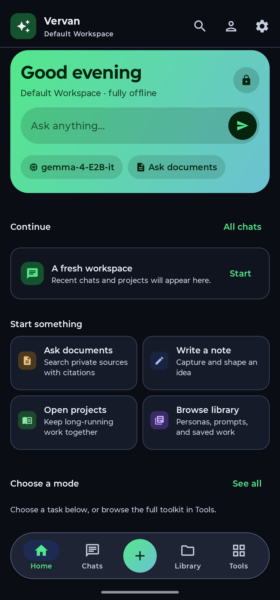
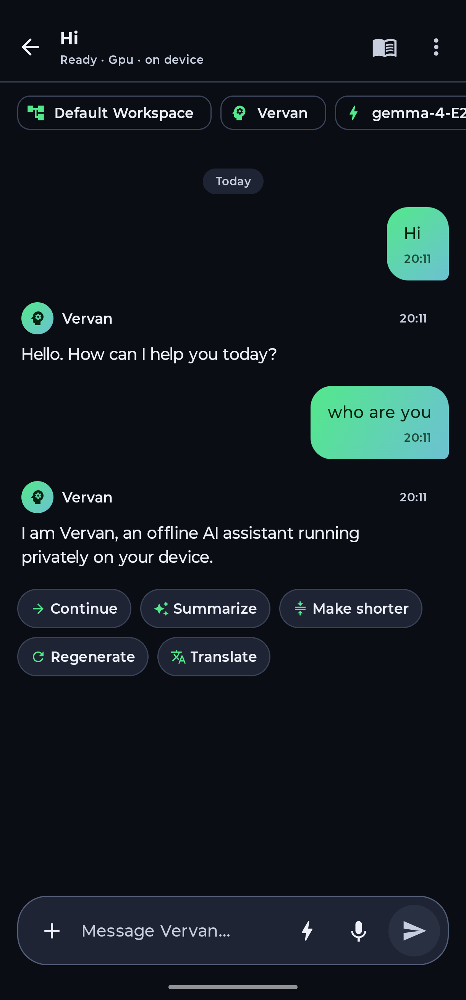
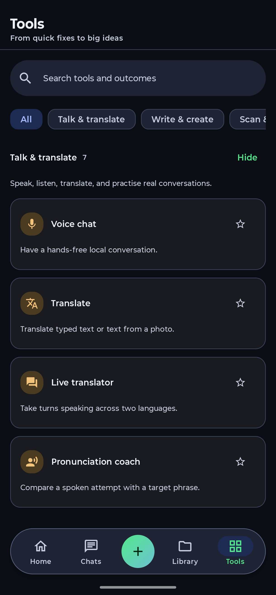
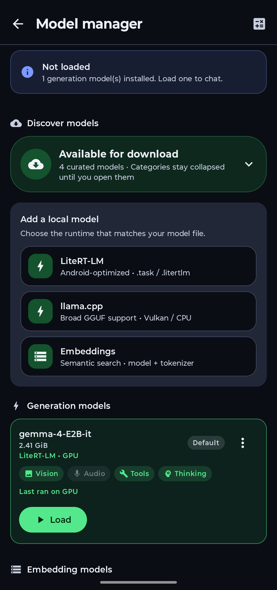
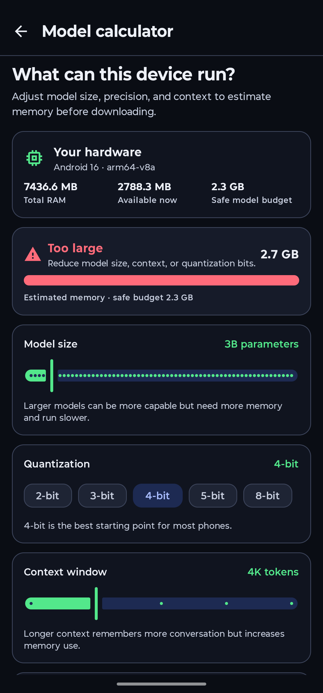
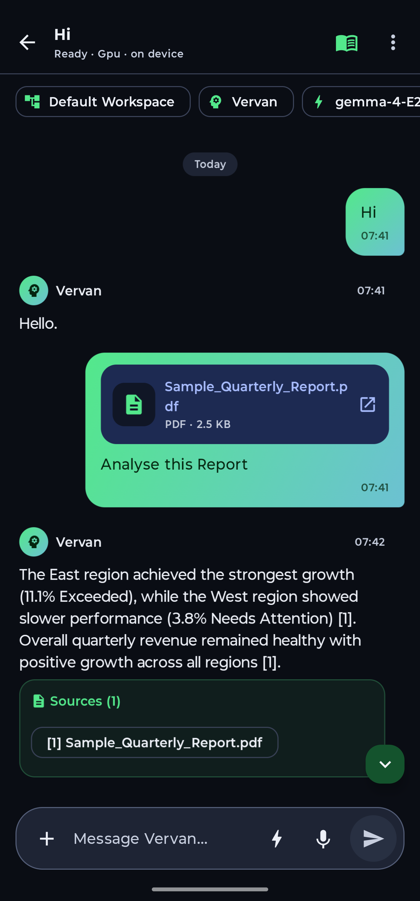
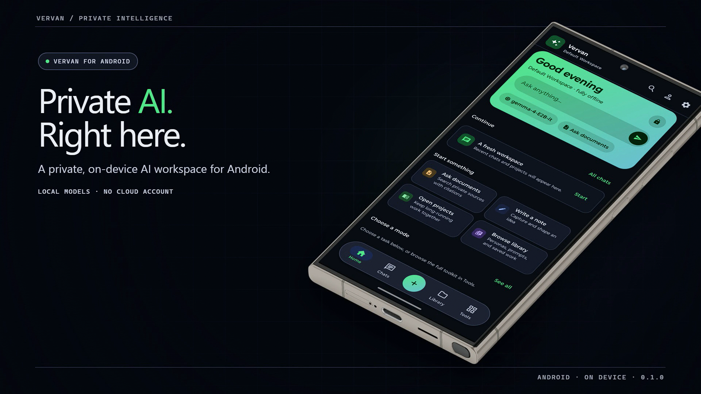

# Vervan Chat

**A private, on-device AI workspace for Android.**

[](https://developer.android.com/about/versions/oreo)
[](https://kotlinlang.org/)
[](https://developer.android.com/compose)
[](LICENSE)
[](#project-status)

Vervan brings local language models, document search, voice tools, notes, and focused AI workspaces into one Android app. Conversations and document processing happen on your device, so you can work without sending your personal content to a hosted AI service.

> [!IMPORTANT]
> Vervan is in early development. Expect rough edges, changing data formats, and features that behave differently across devices and models. AI-generated output can be wrong; review important answers and actions.

## Screenshots

<table>
  <tr>
    <td width="33%" align="center"><br><strong>Home</strong></td>
    <td width="33%" align="center"><br><strong>Chat</strong></td>
    <td width="33%" align="center"><br><strong>Tools</strong></td>
  </tr>
  <tr>
    <td width="33%" align="center"><br><strong>Model Manager</strong></td>
    <td width="33%" align="center"><br><strong>Model Calculator</strong></td>
    <td width="33%" align="center"><br><strong>Document chat</strong></td>
  </tr>
</table>

## Intro Video

[](videos/product-info.mp4)

_Click the preview to watch the demo._

## What you can do with Vervan

- **Chat locally:** Run supported language models directly on your phone, stream responses, branch conversations, and switch between speed, quality, and battery profiles.
- **Work with your files:** Import PDFs, Office documents, EPUBs, HTML, CSV, text files, and images. Vervan can extract or OCR their contents and use them as a local knowledge base.
- **Create focused spaces:** Organize chats, documents, personas, prompts, notes, and settings into reusable workspaces and projects.
- **Use practical AI tools:** Translate text, compare documents, generate quizzes and flashcards, scan receipts or tables, draft emails, explain code, and more.
- **Talk naturally:** Use offline speech-to-text and text-to-speech models for voice chat, pronunciation practice, and live conversation tools.
- **Keep control of your data:** Use temporary chats, an app lock, a recycle bin, local backups, and on-device diagnostics.
- **Connect local clients:** Optionally expose the active model through a small OpenAI-compatible API with `/v1/models` and `/v1/chat/completions` endpoints.
- **Reach Vervan quickly:** Share text or files from other apps, use Android's selected-text action, add home-screen widgets, or enable the floating quick-action bubble.

## Local-first, with clear network boundaries

Vervan does not need a cloud AI account for inference. Chats, notes, imported documents, embeddings, and model execution stay on the device.

An internet connection is still used when you choose to download a model from the in-app catalogue. Vervan currently downloads catalogue models from Hugging Face and verifies packages before importing them. The optional API server is off until enabled; it can be limited to the device or exposed to the local network with bearer-token protection.

The project does not include an analytics SDK or a remote crash-reporting service. Diagnostic and crash information is kept on-device unless you decide to export or share it.

## Models and runtimes

Vervan supports two generation paths:

- **LiteRT-LM:** The default path for `.task`, `.litertlm`, and `.litert` model packages. It requires a 64-bit device.
- **llama.cpp:** An optional build-time integration for GGUF models, including optional vision projectors and LoRA adapters. It can use CPU or Vulkan depending on the device and build.

The in-app catalogue currently includes a Gemma generation model, EmbeddingGemma for semantic search, multilingual Whisper Tiny for offline speech recognition, and English/Hindi on-device voice models. Catalogue contents and third-party model terms can change, so review each model's source and license before downloading it.

Model performance depends heavily on the phone, available memory, context size, and quantization. Vervan includes a model calculator and resource checks, but smaller models are the best place to start on mobile hardware.

## Requirements

### To run the app

- Android 8.0 (API 26) or newer
- An ARM Android device; 64-bit ARM is recommended and required for LiteRT-LM models
- Enough free storage for the app and your chosen models—individual models can require several gigabytes
- Enough available memory for the selected model and context window

### To build the app

- A recent Android Studio release
- JDK 17
- Android SDK 35
- Git
- Android NDK `28.1.13356709` and CMake `3.22.1` only if you are building the optional llama.cpp integration

## Build from source

Clone the repository:

```bash
git clone https://github.com/anand34577/vervan-chat.git
cd vervan-chat
```

Build a debug APK:

```bash
# macOS or Linux
./gradlew assembleDebug

# Windows PowerShell
.\gradlew.bat assembleDebug
```

The APK will be written to `app/build/outputs/apk/debug/app-debug.apk`. You can also open the repository in Android Studio and run the `app` configuration on a physical device.

After installing Vervan, open **Model Manager** to download a catalogue model or import a compatible model already stored on your device.

### Optional GGUF support

Debug builds work without llama.cpp, but GGUF import and inference will be unavailable. Release builds currently require a complete Android llama.cpp build.

To include GGUF support:

1. Build llama.cpp for Android and place its output under `build-android/bin` in the llama.cpp checkout.
2. Make sure the checkout contains `include/llama.h` and these shared libraries: `libllama.so`, `libggml.so`, `libggml-base.so`, `libggml-cpu.so`, and `libggml-vulkan.so`.
3. Add the checkout path to your untracked `local.properties` file:

   ```properties
   llamacpp.dir=D:/path/to/llama.cpp
   ```

4. Build the app normally. Gradle will compile the JNI bridge and copy the native libraries into the APK.

The PowerShell script in `scripts/build-llama-android-vulkan.ps1` is a reference for the expected Android/Vulkan build. Its configuration block contains machine-specific paths and must be adjusted before use. An optional `llamacpp.dir32` property can point to a separate `armeabi-v7a` build.

## Run the tests

```bash
# macOS or Linux
./gradlew testDebugUnitTest

# Windows PowerShell
.\gradlew.bat testDebugUnitTest
```

The JVM test suite covers model loading and downloads, chat behavior, retrieval, imports, voice formatting, tool-call parsing, audio handling, and other core logic.

## Technology overview

- Kotlin and Jetpack Compose with Material 3
- Room and DataStore for local persistence
- LiteRT-LM and optional llama.cpp for generation
- LiteRT/MediaPipe for local embeddings
- sherpa-onnx for offline speech features
- ML Kit, PDFBox, Apache POI, and Jsoup for OCR and document extraction
- Markwon and bundled Mermaid assets for rich, offline response rendering
- NanoHTTPD for the optional local API server

The code is organized by responsibility under `app/src/main/java/com/vervan/chat`: UI screens live in `ui`, persistence in `data`, model execution in `llm` and `modelload`, retrieval in `retrieval`, speech in `voice`, and local integrations in `tools`, `overlay`, and `server`.

## Permissions

Vervan asks for permissions only when a feature needs them:

| Permission | Used for |
| --- | --- |
| Internet | Downloading models and serving the optional local API |
| Microphone | Voice chat, transcription, and pronunciation tools |
| Camera | Document scanning, OCR, and image-based tools |
| Notifications | Long-running generation, model downloads, and foreground services |
| Display over other apps / screen capture | The optional floating assistant and screen explanation |
| Calendar, approximate location, and usage access | Optional on-device assistant tools that you explicitly enable |
| File access on older Android versions | Importing supported files from device storage |

You can review and manage these integrations from Vervan's settings and Android's system settings. Denying an optional permission disables the related feature rather than the core chat experience.

## Project status

The current application version is `0.1.0`. The repository is under active development and is best suited to testing and experimentation rather than critical work. There is not yet a stable migration promise for locally stored data, so export a backup before installing a new build.

Bug reports and focused pull requests are welcome through [GitHub Issues](https://github.com/anand34577/vervan-chat/issues). When reporting a device-specific problem, include the Android version, chipset/ABI, selected model, model format, and the relevant on-device diagnostic log. Do not attach private conversations or documents.

## License

Vervan Chat is available under the [MIT License](LICENSE). Third-party libraries, bundled assets, and downloaded models remain subject to their own licenses.
