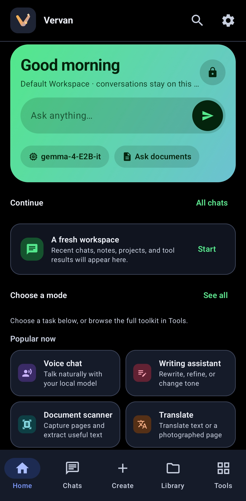
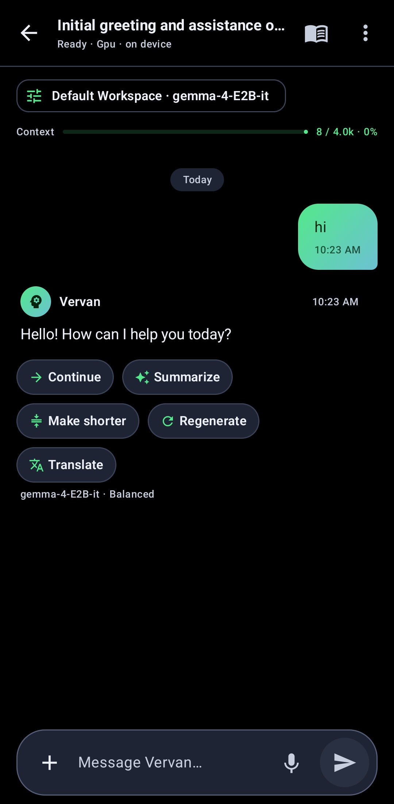
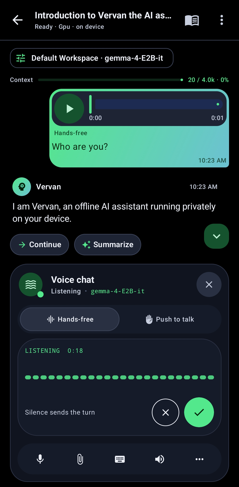
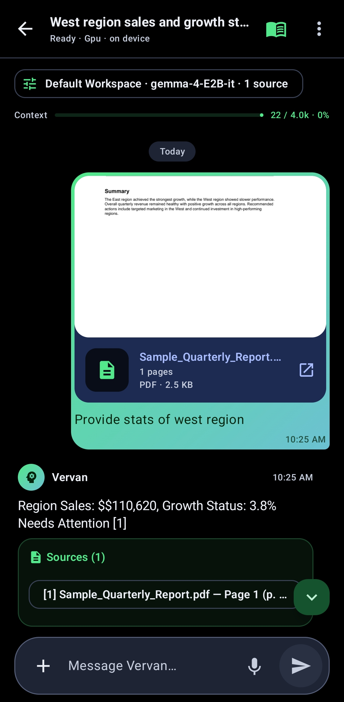
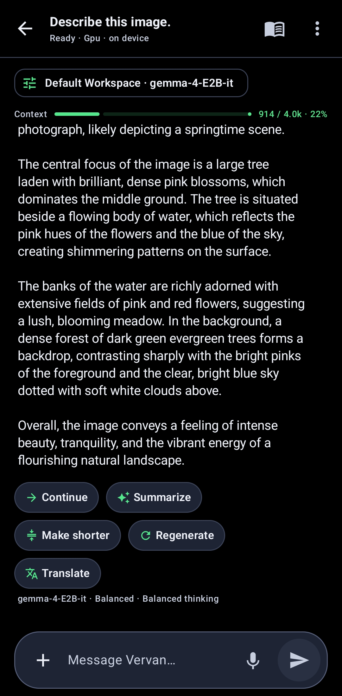
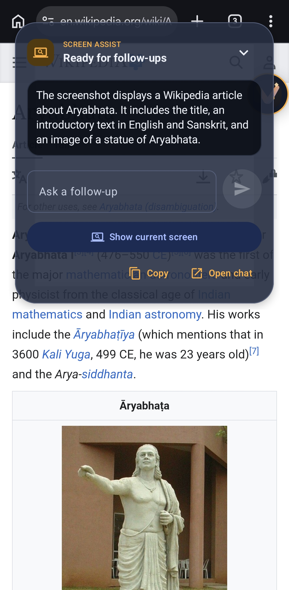

# Vervan Chat

<p align="center">
  
</p>

<p align="center">
  <strong>Your private AI workspace for Android.</strong><br />
  Chat, talk, read documents, understand your screen, and get things done with a model that can run on your phone.
</p>

<p align="center">
  <a href="LICENSE"></a>
  
  
</p>

> Vervan is built for people who want useful AI without making every conversation, document, or voice recording depend on a remote account.

## Why Vervan exists

Most AI assistants send your prompt to a server, process it there, and ask you to trust the boundary between your phone and someone else’s infrastructure.

Vervan gives you another option: install a compatible model on your phone and use it locally. Chats, notes, documents, memories, and retrieval indexes can stay on the device.

The privacy promise is intentionally specific rather than absolute:

- On-device models process prompts locally.
- Model and voice downloads happen only when you request them.
- Remote OpenAI-compatible models are optional. If you add one, prompts sent to it leave the device and are handled by that provider.
- The local API server is optional and off by default. It binds to localhost by default. LAN access and the full web workspace always require an API key; only localhost Basic API mode may be deliberately configured without one.
- Network activity is recorded in Vervan’s in-app audit log.

## What you can do

### Chat naturally

- Stream Markdown responses with tables, tasks, code, and LaTeX.
- Attach images, audio, and documents.
- Continue, branch, export, or keep a conversation incognito.
- Choose a model, thinking level, response profile, and available tools.

### Work with your own files

Import PDFs, Word documents, spreadsheets, presentations, EPUBs, HTML, CSV, text files, scans, and images. Vervan extracts text locally, indexes it, retrieves relevant passages, and shows source context with the answer.

### Talk and listen

Use offline dictation, spoken replies, voice messages, and hands-free voice conversations. The voice pipeline supports on-device speech recognition, text-to-speech, voice activity detection, and barge-in behavior where the selected model and voice package support it.

### Understand your screen

The optional floating assistant can capture and explain the current screen after Android’s screen-capture consent flow. It can also continue the conversation without making you recreate the context manually.

### Turn AI into a workspace

Keep notes, tasks, memories, projects, workspaces, personas, prompt templates, workflows, study materials, flashcards, quizzes, folders, and saved outputs in one local system.

### Use tools with control

Vervan includes tools for translation, rewriting, transcription, document comparison, calculations, unit conversion, timers, pronunciation practice, email drafting, calendar lookup, and more. Tool access can be enabled or disabled, and actions that can change device data or contact another app are guarded by explicit controls.

## Model Store

Vervan has two related model paths:

1. **Model Manager** for importing or downloading supported models directly.
2. **Model Store** for a curated, signed catalogue of installable model variants.

The Model Store catalogue is not meant to live inside this Android repository. It is a separate, small GitHub repository containing:

```text
docs/api/v1/latest.json       # unsigned pointer/index
docs/api/v1/catalog.json      # signed catalogue
docs/api/v1/catalog.json.sig  # detached signature
```

The app verifies the catalogue signature against a public key compiled into the release build. Catalogue entries also use SHA-256 hashes, immutable source revisions, device requirements, and license metadata. Downloads are resumable and installed variants are checked before they are offered to the user.

The repository includes an offline bootstrap catalogue for first-run discovery. Follow [the Model Store publishing guide](docs/model-store-publishing.md) to create the GitHub repository, generate your own signing key, publish with GitHub Pages, and configure the Android release build. The bootstrap is only a signed-build trust input; it is not a substitute for publishing and rotating a real catalogue.

Never use the sample/demo private key for a real catalogue. Anyone who has that private key can sign a catalogue that your app would trust.

## See it in action

### Walkthrough


### Home, chat, and voice

<p align="center">
  
  
  
</p>

### Documents, vision, and screen assistance

<p align="center">
  
  
  
</p>

## How it works

1. **Choose or import a compatible model.** Vervan checks model format, runtime, device ABI, RAM, storage, and capability requirements.
2. **Run inference on the phone.** Supported paths use LiteRT-LM or optional llama.cpp native builds, with CPU/GPU/Vulkan behavior depending on the device and model.
3. **Add local context.** Documents are chunked, indexed, and retrieved from local storage for grounded answers.
4. **Use voice, vision, screen assistance, or tools.** These features share the same workspace and privacy controls.
5. **Review the boundary.** App lock, permissions, network auditing, tool settings, backups, and confirmation prompts keep important decisions visible.

## Privacy model

Vervan is local-first, not magically offline in every configuration.

**Normally stored on the device:** chats, notes, memories, documents, retrieval indexes, local model data, local diagnostics, and supported speech data.

**May leave the device when you choose it:**

- model or voice files downloaded from their configured source;
- prompts, attachments, or audio sent to a remote API model you add;
- requests made through the optional local API server by a client on your network;
- links opened in another app or browser.

Microphone, camera, calendar, notifications, overlay, and screen capture are optional capabilities. Vervan requests them in context rather than requiring them for basic text chat. Review the selected model’s license and the remote provider’s privacy terms before using sensitive content.

## Optional browser interface

Turn on **Settings → Local API server → Full web app mode** to serve a browser interface from the phone. It is a live view of the same local workspace, not a separate cloud copy: chats, notes, documents, knowledge bases, tools, and models remain on the device.

Basic API mode exposes only the OpenAI-compatible inference endpoints. Full web-app mode exposes chats, documents, attachments, and other workspace data, so it always requires an API key—even on localhost. LAN access also always requires a key. The server is off until you enable it, binds to `127.0.0.1` unless LAN access is explicitly enabled, and passes the browser token in a URL fragment so it is not sent as an HTTP query parameter. Browser credentials are kept in session storage rather than persistent local storage. Remote model endpoints must use HTTPS unless they are loopback/emulator-host services; the app disables cleartext traffic globally.

## Technical overview

Vervan is an Android application built with Kotlin and Jetpack Compose.

| Area | Implementation |
| --- | --- |
| App | Kotlin, Jetpack Compose, Navigation Compose, ViewModels |
| Local inference | LiteRT-LM; optional llama.cpp with GGUF, CPU, Vulkan, and native acceleration paths |
| Speech | whisper.cpp / Android speech paths, Piper or Kokoro through ONNX, Supertonic, Silero VAD |
| Retrieval | Local keyword, semantic, and hybrid retrieval over indexed chunks |
| Embeddings | EmbeddingGemma with a local TFLite/LiteRT fallback |
| Storage | Room, local files, encrypted preferences, JSON backup and restore |
| Documents | PDF, Office, EPUB, HTML, CSV, text, image OCR, and scanner flows |
| Integrations | Floating bubble, widgets, shortcuts, share-in, and an optional local API |
| Model Store | Signed catalogue, license acknowledgement, device eligibility, resumable installs, hash checks |

## Build locally

### Requirements

- Android Studio with JDK 17.
- Android SDK 35 for the current checkout, with an Android 8 / API 26+ device or emulator.
- ARM hardware is strongly recommended for local inference.
- Optional native integrations: NDK `28.1.13356709` and CMake `3.22.1`.
- Enough free storage and RAM for the model you want to run. A model file can be several gigabytes.

### Debug build

```bash
git clone <your-repository-url>
cd vervan-chat
./gradlew :app:testDebugUnitTest
./gradlew :app:lintDebug
./gradlew :app:assembleDebug
```

On Windows, use `gradlew.bat` instead of `./gradlew`.

The optional llama.cpp and whisper.cpp integrations are built from local source checkouts. Set these in the uncommitted `local.properties` file when you need them:

```properties
llamacpp.dir=C:/path/to/llama.cpp
whispercpp.dir=C:/path/to/whisper.cpp
```

If they are not configured, the rest of the app can still compile, but the corresponding native capabilities will not be available.

### Release build configuration

Release builds intentionally fail closed until the Model Store trust configuration is present. Supply the public verification key and HTTPS catalogue endpoint through `local.properties` or CI environment variables:

```properties
catalog.publicKeys=<base64-X509-P256-public-key>[,<rotated-key>]
catalog.endpoints=https://<username>.github.io/<catalog-repo>/api/v1/latest.json,https://raw.githubusercontent.com/<username>/<catalog-repo>/main/docs/api/v1/latest.json
```

CI equivalents:

```text
VERVAN_CATALOG_PUBLIC_KEYS
VERVAN_CATALOG_ENDPOINTS
```

The public key is safe to embed in the APK. The corresponding private signing key is not: keep it offline or in a protected signing environment and never commit it.

Once the catalogue is configured, build the Play upload artifact with:

```bash
./gradlew :app:bundleRelease
```

Release builds also fail closed without an app signing key. For local signing, prefer environment variables so passwords do not enter `local.properties`:

```text
VERVAN_RELEASE_STORE_FILE=/path/to/your.keystore
VERVAN_RELEASE_STORE_PASSWORD=<secret>
VERVAN_RELEASE_KEY_ALIAS=<alias>
VERVAN_RELEASE_KEY_PASSWORD=<secret>
```

CI uses the same four variables plus `CATALOG_PUBLIC_KEYS` and `CATALOG_ENDPOINTS` repository secrets, mapped to the `VERVAN_CATALOG_*` variables in the release workflow.

### Continuous integration

[`.github/workflows/android.yml`](.github/workflows/android.yml) runs a debug build/lint/test verification on every push (no native backends — `llamacpp.dir`/`whispercpp.dir` are unset in CI, so that target is skipped, same as an offline checkout).

[`.github/workflows/release.yml`](.github/workflows/release.yml) runs on a `vX.Y.Z` tag push: it builds llama.cpp and whisper.cpp **CPU-only** for Android (`scripts/ci/build-native-android-linux.sh` — a Linux/CI-only counterpart to the Vulkan-capable `scripts/build-llama-android-vulkan.ps1`/`scripts/build-whisper-android.ps1`, which stay Windows-only since the Vulkan backend needs MSVC + the Vulkan SDK on the host), runs unit tests and release lint, signs the resulting APK and AAB, and attaches both to a GitHub Release. See the comments in `release.yml` for the required repository secrets. Build the Vulkan-accelerated variant locally if you need GPU acceleration in a release.

## Project map

```text
app/src/main/java/        Android application and feature code
app/src/main/assets/      Bundled runtime assets and optional catalogue bootstrap
app/src/main/cpp/         JNI bridges for optional native runtimes
app/src/test/             JVM unit tests
app/src/androidTest/      Android/Room migration tests (run on a connected device or emulator)
app/schemas/              Exported Room database schemas
docs/                     Screenshots, mockups, and publishing notes
scripts/                  Native build and development helpers
vervan_logo.svg           Primary brand mark
app_icon.svg              Application icon
```

## Current status

Vervan is a serious early-development project with a broad product surface. The main flows and a substantial test suite are present, but the public release still needs hardening.

Before calling it production-ready, complete at least the following:

- publish a real signed Model Store catalogue and configure its public key and HTTPS endpoints;
- test the release bundle on real low-, mid-, and high-memory ARM devices, including interrupted downloads and thermal throttling;
- review every permission, foreground-service type, overlay flow, screen-capture flow, and remote API path for Play Console disclosure and policy fit;
- publish a privacy policy and complete Play Console’s Data safety, content rating, target audience, app access, and foreground-service declarations;
- update the Android target/compile configuration and increment `versionCode` immediately before the Play release;
- provide a support/contact path and a clear way for users to report crashes or model-download failures.

## Who is likely to enjoy Vervan?

Vervan should appeal to privacy-focused users, developers, students, researchers, and people who want an offline-capable AI toolbox. Its strongest advantage is the combination of local inference, document work, voice, and a transparent model boundary.

The main adoption risks are also clear: local models need storage and RAM, performance varies widely by phone, and the number of features can make the first experience feel dense. A polished Play launch should lead with one simple promise—private AI that works on your device—then introduce the deeper workspace gradually.

## Contributing

Issues, focused improvements, documentation updates, UI polish, model compatibility work, performance fixes, and privacy reviews are welcome. When proposing a feature, describe:

1. what the user is trying to do;
2. what stays on-device and what can leave it;
3. which permissions, model formats, or device requirements are involved; and
4. how the behavior can be tested on a real Android device.

## License

Vervan Chat is released under the [MIT License](LICENSE). Copyright © 2026 Anand.
