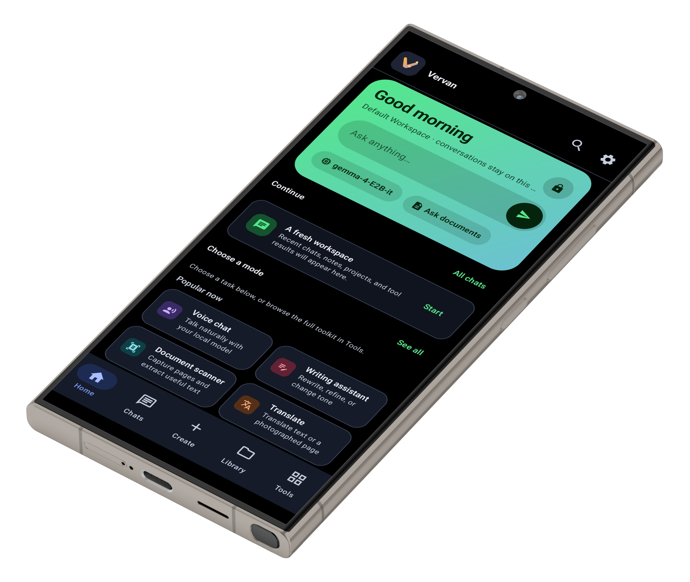
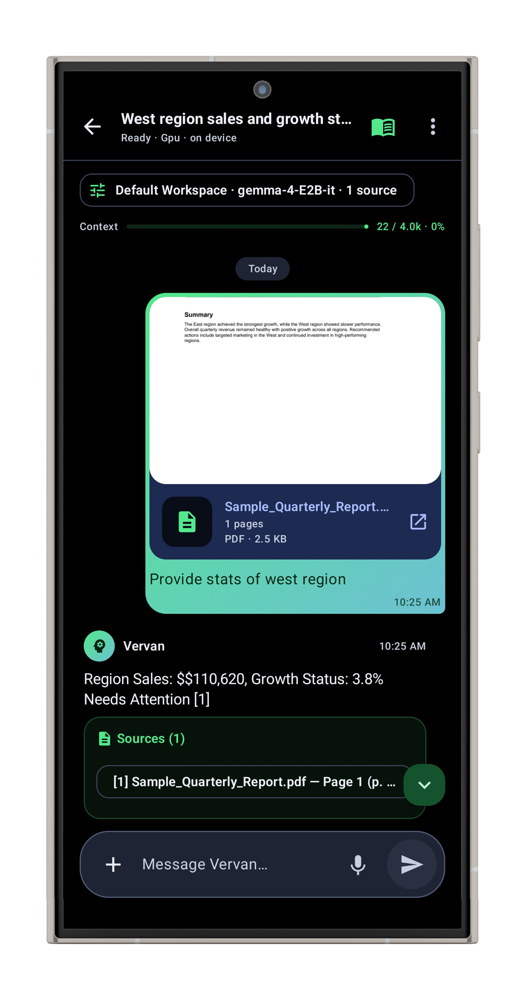
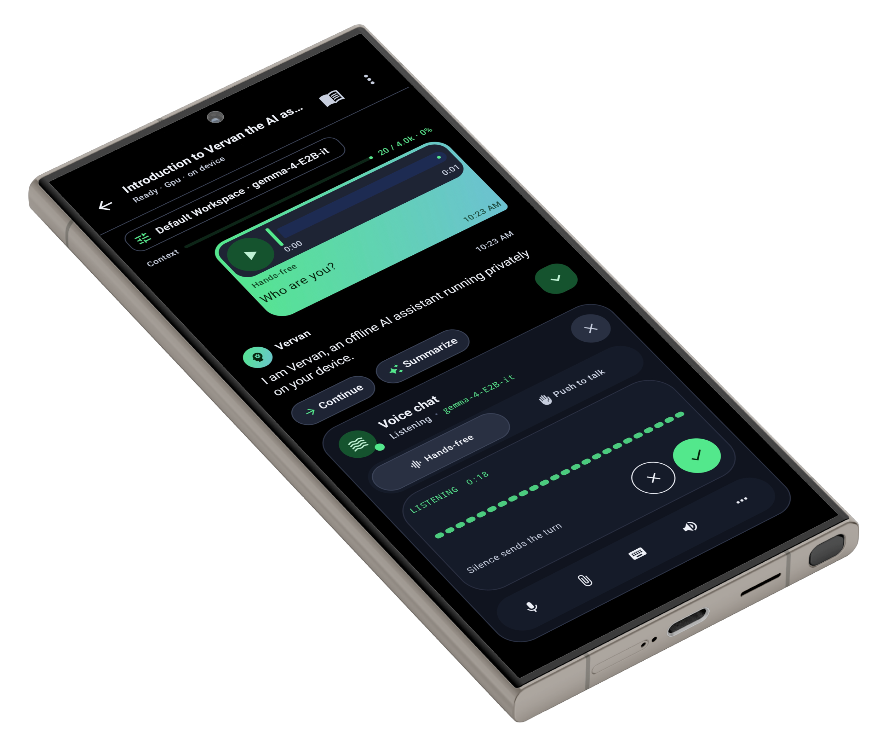

# Vervan Chat

<p align="center">
  
</p>

<p align="center">
  <strong>Your private AI, living entirely on your phone.</strong><br />
  Chat, talk, read documents, understand your screen, and get things done — with the model running locally on Android.
</p>

<p align="center">
  <a href="LICENSE"></a>
  
  
</p>

> Vervan is an offline-capable AI workspace for people who want useful AI without making their conversations, documents, and voice data depend on a remote AI account.

## Why Vervan exists

Most AI assistants send your prompt to a server, process it there, and ask you to trust the boundary between your phone and someone else’s infrastructure.

Vervan takes a different approach: install a compatible model on your phone, then use it locally. Your chats, notes, documents, and memories can stay on the device. Network access is reserved for user-initiated model downloads and the optional local API server.

The goal is simple:

**Your AI. Your data. Your device.**

## What you can do

### Chat naturally

- Stream rich Markdown responses with tables, tasks, and LaTeX.
- Attach images and files, continue a conversation, or branch it into a new direction.
- Choose the model, thinking level, and available tools for each chat.
- Export conversations and use incognito chats when you do not want them saved.

### Ask questions about your own files

Import PDFs, Word documents, spreadsheets, presentations, EPUBs, HTML pages, CSVs, text files, scans, and images. Vervan extracts local text, retrieves the most relevant passages, and shows sources with the answer.

### Talk and listen

Use offline dictation, spoken replies, and a hands-free voice mode with natural turn-taking. The voice stack is designed for on-device speech-to-text, text-to-speech, voice activity detection, and barge-in. Hindi support is included in the product direction.

### Understand what is on your screen

The floating screen assistant can summarize or explain the current screen across other apps. It can also support follow-up questions without forcing you to rebuild the context manually.

### Turn AI into a workspace

Keep notes, tasks, memories, projects, workspaces, personas, prompt templates, workflows, smart collections, study materials, flashcards, and quizzes in one local system.

### Use practical tools with approval

Vervan includes a growing toolkit for translation, rewriting, transcription, email drafting, document comparison, calculations, unit conversion, timers, pronunciation practice, and more. Actions that can affect your device or data are designed around explicit confirmation and an audit trail.

## See it in action
### Walkthrough


### Home and chat

<p align="center">
  
  
  
</p>

### Documents, vision, and screen assistance

<p align="center">
  
  
  
</p>


<p align="center">
  
  
  
</p>


## How it works

1. **Choose or import a compatible model.** Vervan supports local model management and device-aware loading.
2. **Run inference on the phone.** The app can use CPU, GPU/Vulkan, or supported acceleration paths, with a fallback where available.
3. **Add local context.** Documents are chunked, indexed, and retrieved from the device for grounded answers.
4. **Use voice, vision, or tools.** Speech, image understanding, screen assistance, and actions plug into the same local workspace.
5. **Keep control.** App lock, permissions, network audit, tool toggles, backups, and confirmation prompts make the trust boundary visible.

## Privacy model

Vervan is designed around a clear boundary:

- **On-device:** chat inference, local retrieval, notes, memories, document indexes, and supported speech features.
- **User initiated:** downloading models or using the optional local API server.
- **Explicit permission:** microphone, camera, notifications, overlay/screen capture, calendar, and location-related features.
- **Visible control:** privacy dashboard, network audit log, app lock, biometric unlock, secure-delete workflow, backup and restore.

“Local” depends on the model and backend you choose. Vervan’s UI is intended to make that state visible rather than hiding it behind a generic loading spinner.

## Technical overview

Vervan is an Android application built with Kotlin and Jetpack Compose.

| Layer           | Current direction                                                                         |
| --------------- | ----------------------------------------------------------------------------------------- |
| App             | Kotlin, Jetpack Compose, Navigation Compose, ViewModels                                   |
| Local inference | LiteRT-LM for supported paths; llama.cpp with GGUF, CPU/Vulkan, and optional acceleration |
| Speech          | whisper.cpp / Android speech paths, Piper or Kokoro via ONNX, Supertonic, Silero VAD      |
| Retrieval       | Local keyword, semantic, and hybrid retrieval over indexed chunks                         |
| Embeddings      | EmbeddingGemma with a local TFLite fallback                                               |
| Storage         | Room database, local files, encrypted preferences, JSON backup/restore                    |
| Documents       | PDF, Office, EPUB, HTML, CSV, text, image OCR, and scanner flows                          |
| Integration     | Floating bubble, widgets, shortcuts, share-in, and optional local OpenAI-compatible API   |

## Build locally

### Requirements

- Android Studio with JDK 17
- Android SDK 35 and an Android 8 / API 26+ device or emulator
- ARM hardware is recommended for local model execution
- Optional native integrations: NDK `28.1.13356709` and CMake `3.22.1`
- Enough storage and memory for the model you want to run

### Run

```bash
git clone <your-repository-url>
cd ai-chat
./gradlew :app:assembleDebug
```

Install the generated debug APK on a compatible device. Model downloads are intentionally separate from the app build because model size and hardware requirements vary.

Native backends such as llama.cpp and whisper.cpp are optional source-driven integrations. Follow the project’s local setup notes before enabling them in a release build.

## Project map

```text
app/                 Android application and feature code
ui/                  Shared UI components and visual language
docs/                Product notes, screenshots, mockups, and supporting material
scripts/             Build and development helpers
vervan_logo.svg      Primary brand mark
app_icon.svg         Application icon
```

## Development status

Vervan is an ambitious early-development project and should be treated accordingly. The core product direction and many UI flows are present, but several areas still need hardening before a production release:

- The newer signed Model Store flow still needs its production catalog and key material.
- Database migration coverage needs to replace the current early-stage fallback behavior.
- Some native inference and voice integrations are optional and require local source/build setup.
- Thermal management, cancellation races, retrieval performance, import errors, and a few tool-loop edge cases are still active engineering work.

These constraints are documented so contributors can understand the real state of the project, not just the polished interface.

## Contributing

Issues, focused improvements, documentation updates, UI polish, model compatibility work, and privacy reviews are welcome. When proposing a feature, describe:

1. what the user is trying to do,
2. what stays on-device,
3. what permissions or model requirements are involved, and
4. how the behavior can be tested on a real Android device.

## License

Vervan Chat is released under the [MIT License](LICENSE). Copyright © 2026 Anand.
